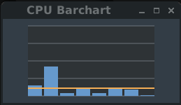

# CPU Barchart

## What is CPU Barchart
CPU Barchart is a small utility showing the activity of each CPU core on a Linux computer.
 

The vertical axis represents the instantaneous activity level in percent.

The orangish horizontal line shows the average activity level. 

The window can be resized, and a mouse click (any button) will get it back to the original size.

## Compile
Install the required development libraries for gtk+-3.0.

Then `make`, and `./cpuchartbar`

Enjoy! 